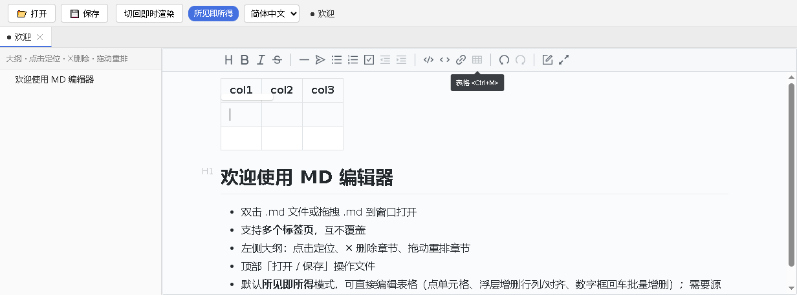
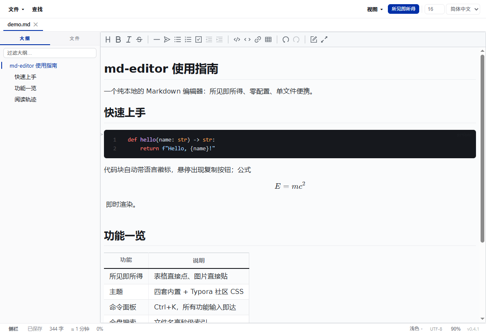
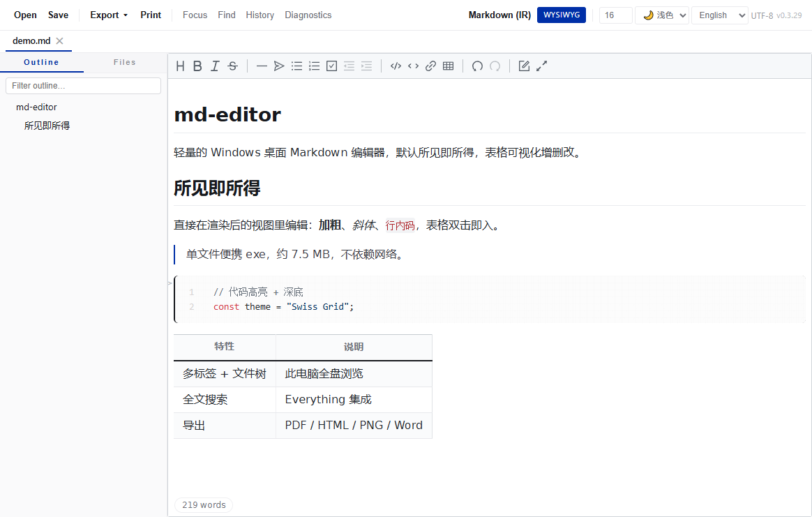

# MD 编辑器 · MD Editor




**[中文](#中文) · [English](#english)**

---

## 中文

一款轻量的 Windows 桌面 Markdown 编辑器，**默认所见即所得，支持表格可视化增删改**，内置**中英双语界面**（中文支持简体/繁体）。基于 Tauri 2 + Vditor，单文件便携 exe（约 15 MB），不依赖网络。

> 📑 目录：[功能](#-功能) · [下载](#-下载) · [用法](#-用法) · [竞品对比](#-竞品对比) · [构建](#-从源码构建) · [技术栈](#-技术栈)

### ✨ 功能

- **默认所见即所得**：直接编辑表格——点单元格改内容、光标进表浮出工具栏（上下插行 / 左右插列 / 删行删列 / 对齐 / 删表）、行/列数字框输入数字 + 回车**批量增删**
- **中英双语界面**：中文（简体 / 繁体）/ English，跟随系统语言并记住你的选择
- **多标签页**：打开多个文件互不覆盖，同路径自动跳转
- **左侧大纲**：点击定位、✕ 删除章节（联动正文）、拖动重排
- **多种打开方式**：双击 .md / 拖拽到窗口 / 命令行参数 / 单实例转发
- **编码自动识别**：UTF-8 / UTF-8(BOM) / GBK
- **内容增强**：数学公式（KaTeX 行内/块级即时渲染）、Mermaid/echarts 图表（mindmap、timeline、flowchart…）、代码块行号、emoji `:smile:` 自动补全（1500+）
- **查找替换**：`Ctrl+F` / `Ctrl+H`，全部匹配高亮 + 计数导航 + 逐个/全部替换（走编辑管线，可撤销）
- **专注模式**：`F8` 淡化非当前段落（打字机模式已按需求移除；粘贴长文本后视口自动滚到光标处）
- **自动保存**：已有路径的文档每 30 秒及窗口失焦时自动落盘
- **显示比例**：Word 式右下角缩放滑杆（50%~200%），`Ctrl+滚轮` 缩放、`Ctrl+0` 复位——只缩正文内容区，工具栏/大纲不动，设置重启后记住
- **导出中心**：顶部「导出 ▾」——PDF（矢量）、HTML（带样式 / 纯净两档）、PNG 长图（超画布上限自动分片，Typora 官方不支持）、Word .docx（标题/嵌套列表(Word原生编号)/表格/代码/链接/图片真嵌入/脚注）、复制富文本（粘贴到 Word/邮件带格式）；**Pandoc 桥**——把 `pandoc.exe` 放到软件旁即解锁 EPUB / LaTeX / RTF
- **粘贴截图落地**：`Ctrl+V` 粘贴图片自动保存到文档旁 `assets/`，正文以**相对路径**引用——源码整个文件夹拷走图片不丢
- **中文排版**：渲染与导出时中英文之间自动加空格（不改源文）
- **字数统计**：右下角实时显示（简中「字」/ English "words"）
- **隐私**：不请求麦克风（已禁用编辑器内核自带的录音模块）

> ⚠️ 已知取舍：所见即所得模式下，本地相对路径图片在编辑器内**不显示缩略图**（源码保持相对路径以确保可移植；导出 PDF/HTML/PNG/Word/复制富文本时会自动嵌入图片）。

<details>
<summary>📸 界面截图</summary>





</details>

### 📥 下载

[](https://github.com/frandy820/md-editor/releases/latest)

去 [Releases](https://github.com/frandy820/md-editor/releases) 下载 `md-editor.exe`，双击即可运行（便携，免安装）。

**设为 .md 默认程序**：右键任意 .md → 打开方式 → 选 `md-editor.exe` → 勾选「始终使用此应用」。

### 📖 用法

| 操作 | 说明 |
|---|---|
| 编辑表格 | 光标点进表格单元格 → 浮出工具栏；或在行/列数字框输入目标数 + 回车批量增删 |
| 切换语言 | 右上角下拉：简体中文 / 繁體中文 / English |
| 切换模式 | 默认所见即所得；需要看 markdown 源码时点顶部「即时渲染」或 `Ctrl+Alt+M` |
| 大纲 | 左侧：点章节定位 / ✕ 删章节 / 拖动重排 |
| 数学公式 | 行内 `$x^2$`、块级 `$$…$$`，KaTeX 即时渲染 |
| 图表 | mermaid 代码块（mindmap / timeline / flowchart…），光标移出代码块即渲染 |
| emoji | 输入 `:` 加关键词（如 `:smi`）弹出补全 |
| 查找替换 | `Ctrl+F` 查找 / `Ctrl+H` 带替换；`Enter`/`Shift+Enter` 上下跳转，`Esc` 关闭 |
| 专注模式 | `F8` 淡化其他段落 |
| 缩放 | 右下角滑杆拖动 / `Ctrl+滚轮` / `Ctrl+0` 复位（50%~200%，只缩正文） |
| 导出 | 顶部「导出 ▾」：PDF / HTML 两档 / PNG 长图 / Word / 复制富文本；EPUB/LaTeX/RTF 需在软件旁放 `pandoc.exe` |
| 粘贴截图 | 直接 `Ctrl+V`，图片自动存到文档旁 `assets/`，正文引用相对路径 |
| 粘贴跟随 | 粘贴长文本后视口自动滚到光标 |
| 自动保存 | 已保存过的文档每 30s 及失焦时自动落盘（标题 ● 消失即已存） |
| 快捷键 | `Ctrl+B` 加粗、`Ctrl+I` 斜体、`Ctrl+S` 保存、`Ctrl+Alt+M` 切模式 |
| 保存 | 统一写 UTF-8 无 BOM；拖入打开的文件保留原路径，可直接保存 |

### 🆚 竞品对比

| 项目 | 免费 | 便携免安装 | 表格可视化编辑 | 多标签 | 中英双语 | 开源 |
|---|---|---|---|---|---|---|
| **md-editor** | ✅ | ✅ 单文件 exe | ✅ 浮层 + 数字框批量 | ✅ | ✅ | ✅ |
| Typora | ⚠️ 收费 | ❌ 需安装 | ⚠️ 基础 | ❌ 仅 macOS | ✅ | ❌ |
| MarkText | ✅ | ❌ 需安装 | ⚠️ 基础 | ✅ | ⚠️ | ✅ |
| Obsidian | ✅ | ❌ 需安装 | ⚠️ 需插件 | ✅ | ✅ | ❌ |
| Easy MD | ✅ | ❌ | ⚠️ 弱 | ⚠️ | ❌ | ✅ |

### 🛠️ 从源码构建

```bash
git clone https://github.com/frandy820/md-editor.git
cd md-editor
npm install
# 复制 Vditor 本地化资源（CSP 要求本地加载，不走 CDN）
mkdir -p public/vditor-assets && cp -r node_modules/vditor/dist/* public/vditor-assets/dist/
npm run tauri build -- --no-bundle
# 产物：src-tauri/target/release/md-editor.exe
```

开发模式：`npm run tauri dev`

> 打包必须用 `tauri build`（不要用 `cargo build --release`，否则 exe 会连 localhost dev server）。
> 国内 Rust 依赖拉取慢，建议配 [rsproxy](https://rsproxy.cn) 镜像（`~/.cargo/config.toml`）。

### 🧱 技术栈

- [Tauri 2](https://tauri.app/) — Rust 后端 + WebView2 前端
- [Vditor](https://github.com/Vanessa219/vditor) 3.11 — Markdown 编辑器内核
- TypeScript + Vite

### 📄 协议

[MIT](./LICENSE)

---

## English

A lightweight WYSIWYG Markdown editor for Windows with **visual table editing**, offering a **bilingual interface** (English / Chinese, with both Simplified & Traditional). Built with Tauri 2 + Vditor. Single portable `.exe` (~15 MB), no install, no network.

> 📑 Contents: [Features](#-features) · [Download](#-download) · [Usage](#-usage) · [Comparison](#-comparison) · [Build](#-build-from-source) · [Tech stack](#-tech-stack)

### ✨ Features

- **WYSIWYG by default**: edit tables directly — click a cell to edit, cursor into a table pops up a floating toolbar (insert row above/below, insert column left/right, delete row/column, align, delete table); type a number + Enter in the row/column box to **batch add/remove**
- **Bilingual UI (English / Chinese)**: Chinese supports both Simplified & Traditional — auto-detects system language and remembers your choice
- **Multi-tab**: open multiple files without overwriting; same path auto-switches
- **Left outline**: click to navigate, ✕ to delete a section (updates body too), drag to reorder
- **Multiple ways to open**: double-click .md / drag into window / command-line arg / single-instance forwarding
- **Encoding auto-detection**: UTF-8 / UTF-8(BOM) / GBK
- **Rich content**: math formulas (KaTeX inline & block, live rendering), Mermaid/echarts diagrams (mindmap, timeline, flowchart…), code line numbers, emoji `:smile:` autocomplete (1500+)
- **Find & replace**: `Ctrl+F` / `Ctrl+H` — highlight all matches, count & navigate, replace one/all (undoable)
- **Focus mode**: `F8` dims other paragraphs (typewriter mode removed on request; the view scrolls to the caret after pasting long text)
- **Autosave**: files with a path are saved every 30s and on window blur
- **Zoom**: Word-style slider at the bottom-right (50%–200%), `Ctrl+wheel` to zoom, `Ctrl+0` to reset — zooms the content area only, toolbars/outline untouched; the level persists across restarts
- **Export center**: top "Export ▾" — PDF (vector), HTML (styled / plain), PNG long image (auto-sliced past the canvas limit — Typora can't), Word .docx (headings/nested lists w/ native numbering/tables/code/links/embedded images/footnotes), copy-as-rich-text (paste into Word/email with formatting); **Pandoc bridge** — drop `pandoc.exe` next to the app to unlock EPUB / LaTeX / RTF
- **Paste screenshots**: `Ctrl+V` an image and it is saved to `assets/` beside the document, referenced by a **relative path** — move the folder, keep the images
- **CJK typography**: auto-spacing between CJK & Latin text on render & export (source untouched)
- **Word count**: live counter at the bottom-right corner ("words" / 「字」)
- **Privacy**: no microphone access (the editor core's built-in recording module is disabled)

> ⚠️ Known trade-off: in WYSIWYG mode, local relative-path images show **no thumbnail** inside the editor (the source keeps relative paths for portability; images are embedded automatically on PDF/HTML/PNG/Word export and rich-text copy).

<details>
<summary>📸 Screenshots</summary>


</details>

### 📥 Download

[](https://github.com/frandy820/md-editor/releases/latest)

Grab `md-editor.exe` from [Releases](https://github.com/frandy820/md-editor/releases) — double-click to run (portable, no install).

**Set as default .md app**: right-click any .md → Open with → choose `md-editor.exe` → check "Always use this app".

### 📖 Usage

| Action | How |
|---|---|
| Edit table | Click into a table cell → floating toolbar appears; or type a target number + Enter in the row/column box to batch edit |
| Switch language | Top-right dropdown: 简体中文 / 繁體中文 / English |
| Switch mode | WYSIWYG by default; click top "Instant Rendering" or `Ctrl+Alt+M` to view markdown source |
| Outline | Left panel: click a heading to navigate / ✕ to delete / drag to reorder |
| Math | Inline `$x^2$`, block `$$…$$` — rendered live via KaTeX |
| Diagrams | mermaid code blocks (mindmap / timeline / flowchart…) render on blur |
| Emoji | Type `:` + keyword (e.g. `:smi`) for autocomplete |
| Find & replace | `Ctrl+F` find / `Ctrl+H` with replace; `Enter`/`Shift+Enter` navigate, `Esc` close |
| Focus | `F8` dim others |
| Zoom | drag the bottom-right slider / `Ctrl+wheel` / `Ctrl+0` reset (50%–200%, content only) |
| Export | top "Export ▾": PDF / HTML ×2 / PNG / Word / copy rich text; EPUB/LaTeX/RTF need `pandoc.exe` beside the app |
| Paste image | just `Ctrl+V` — saved to `assets/` beside the doc, referenced relatively |
| Paste follow | view scrolls to the caret after pasting |
| Autosave | Documents with a path save every 30s & on blur (● in title disappears once saved) |
| Shortcuts | `Ctrl+B` bold, `Ctrl+I` italic, `Ctrl+S` save, `Ctrl+Alt+M` toggle mode |
| Save | Always writes UTF-8 without BOM; dragged-in files keep their path for direct save |

### 🆚 Comparison

| Project | Free | Portable (no install) | Visual table editing | Tabs | Bilingual (EN/中) | Open source |
|---|---|---|---|---|---|---|
| **md-editor** | ✅ | ✅ single .exe | ✅ toolbar + batch | ✅ | ✅ | ✅ |
| Typora | ⚠️ paid | ❌ install | ⚠️ basic | ❌ macOS only | ✅ | ❌ |
| MarkText | ✅ | ❌ install | ⚠️ basic | ✅ | ⚠️ | ✅ |
| Obsidian | ✅ | ❌ install | ⚠️ plugin | ✅ | ✅ | ❌ |
| Easy MD | ✅ | ❌ | ⚠️ weak | ⚠️ | ❌ | ✅ |

### 🛠️ Build from source

```bash
git clone https://github.com/frandy820/md-editor.git
cd md-editor
npm install
# Copy Vditor localized assets (CSP requires local loading, no CDN)
mkdir -p public/vditor-assets && cp -r node_modules/vditor/dist/* public/vditor-assets/dist/
npm run tauri build -- --no-bundle
# Output: src-tauri/target/release/md-editor.exe
```

Dev mode: `npm run tauri dev`

> You must build with `tauri build` (not `cargo build --release`, or the exe will point at the localhost dev server).
> For faster Rust dependency downloads in China, configure the [rsproxy](https://rsproxy.cn) mirror (`~/.cargo/config.toml`).

### 🧱 Tech stack

- [Tauri 2](https://tauri.app/) — Rust backend + WebView2 frontend
- [Vditor](https://github.com/Vanessa219/vditor) 3.11 — Markdown editor core
- TypeScript + Vite

### 📄 License

[MIT](./LICENSE)
